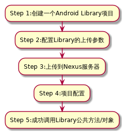
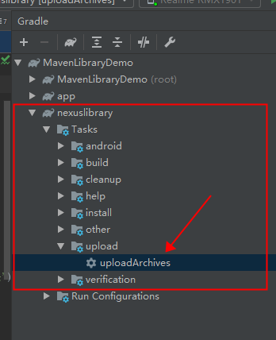
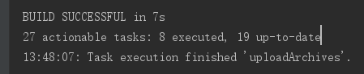
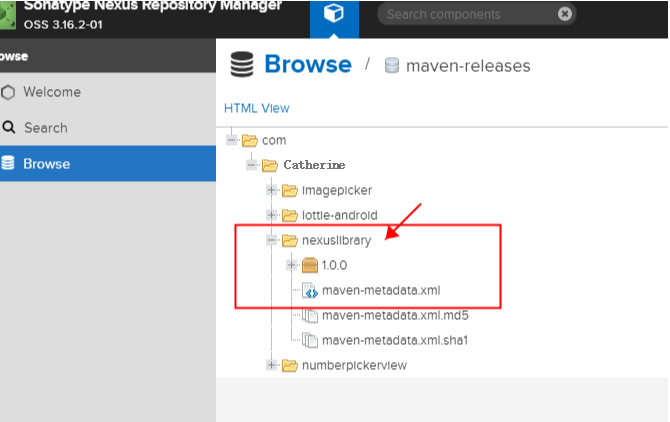
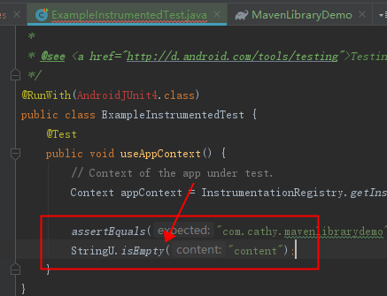
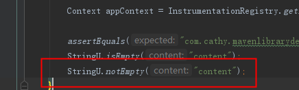
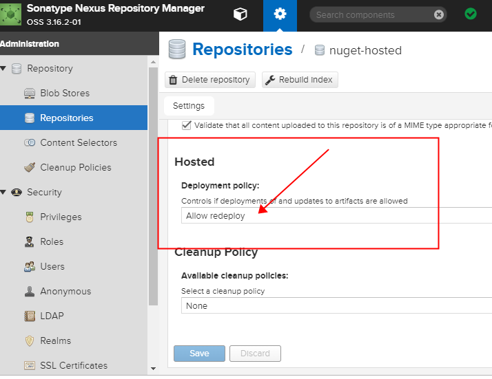

### Maven使用：从依赖包到Maven库到成功引用
---
[参考文档](https://blog.csdn.net/qq_32452623/article/details/79385595)

实现库的上传的方式有两种：

1. 使用Gradle集成的Maven插件上传
2. [命令行上传](https://www.csdn.net/link?target_url=https%3A%2F%2Fwww.xncoding.com%2F2017%2F09%2F02%2Ftool%2Fnexus.html&id=79385595&token=792e86748b6affff1e992c265ce9d92a)

这里我们以第一种方式为例：



#### Step 1:创建一个Android Library项目
---
首先，我们创建一个Library Module，命名；以`nexuslibrary` 为例。然后完成代码构建，以及提供公共方法的访问权限。示例：

```
/**
 * this is a demo test about how to upload file to nexus
 * Create by Catherine
 * Date:2019-09-18
 */
public class StringU {
    public static boolean isEmpty(String content){
        if (content==null
                ||TextUtils.isEmpty(content)
                ||content.trim()==null){
            return true;
        }
        return false;
    }
}

```

#### Step 2:配置Library的上传参数
---
在Library Module中创建一个 `gradle.properties` 文件，用以记录：

* Nexus的用户名称和密码
* 要上传的目标仓库地址
* 上传的Library构件信息

如下所示：

```
//上传构件的信息
GROUP=com.cathy
VERSION_NAME=1.0.0
POM_ARTIFACT_ID=nexuslibrary

//上传的目标仓库地址
SNAPSHOT_REPOSITORY_URL=http://localhost:8081/repository/maven-snapshots/
RELEASE_REPOSITORY_URL=http://localhost:8081/repository/maven-releases/

//Nexus 的私服的用户名称和密码
NEXUS_USERNAME=admin
NEXUS_PASSWORD=admin123

```

`注意：用户名称默认是Admin，密码则位于自己下载安装的Nexus-version\sonatype-work\nexus3\admin.password文件里面，登录之后可以修改密码`


新建 `upload_nexus.gradle`文件，添加以下配置：[upload_nexus.gradle](http://10.191.80.217/android-group/maven/document/blob/master/src/upload_nexus.gradle)，用来生成source.jar 源码包、javadoc.jar方法文档和创建上传的Gradle Task.然后在build.gradle中使用upload_nexus.gradle。调用方式如下：
```
apply from: 'upload_nexus.gradle'
```
当然，也可以把这些配置直接添加在Library Module 的 build.gradle中,只不过前者相对更简洁一点。

#### Step 3:上传到Nexus服务器
---

打开Android Studio 中打开右侧的Gradle侧边栏，打开`nexuslibrary`,找到uploadArchives,这就是刚才创建的上传Task，双击即可开始上传。



`注意：允许匿名访问，否者会因为对Nexus服务的访问受限而上传失败`

[Configure Anonymous Access](https://help.sonatype.com/repomanager3/security/anonymous-access)


直到输出框显示类似结果，那么恭喜你，uploadArchives Task 执行成功，现在我们去Nexus仓库中可以看到上传的Library构件包了。如下图：



然后我们去Maven仓库也可以看到此Library：



既然已经上传成功了，那接下来就是激动人心的时刻了：通过下载引用该Library构件

#### Step 4:项目配置
---

首先我们在需要调用的project的build.gradle中引用私库地址,如下所示：

```

allprojects {
    repositories {
        //...
        //添加本地仓库地址
        maven { url 'http://localhost:8081/repository/maven-public/' }

    }
}
```

在需要引用该Library的目标Module的build.gradle 中添加此库的依赖：

```

dependencies {
  //...
implementation 'com.cathy:nexuslibrary:1.0.0'
}

```
### Step 5:成功调用Library公共方法/对象
---
然后执行sync gradle成功之后，我们就可以去试试应用该库的公共类和方法了。



okay,一个基本的从库的创建到上传到成功引用已经完成。

---

#### Q1：release和snapshot库的区别

现在我们点击再次上传，你会发现上传失败，并提示如下错误：

```

Error:Execution failed for task ‘:nexuslibrary:uploadArchives’.
Could not publish configuration ‘archives’
Failed to deploy artifacts: Could not transfer artifact com.cathy:nexuslibrary:aar:1.0.0 from/to remote (http://localhost:8081/repository/maven-releases/): Failed to transfer file: http://localhost:8081/repository/maven-releases/com/cathy/nexuslibrary/1.0.0/nexuslibrary-1.0.0.aar. Return code is: 400, ReasonPhrase: Repository does not allow updating assets: maven-releases.

```
原因在于，release 仓库不能重复上传同一版本号，版本不能覆盖，只能迭代。
所以，如果我们想保持版本号不变，然后添加内容，然后服务器仓库也能更新的话，就要用到我们的snapshot仓库。

snapshot 仓库允许版本覆盖。当我上传多次上传同一个版本到 snapshot 仓库，会自动在版本号上添加时间戳来区分。

可是我们库的配置文件里面写了Release和snapshot两种目标仓库，但是在服务器上只有maven-release仓库下面才有，而maven-snapshot仓库下面是空的呢？请看：

---

#### Q2:那什么时候用到release仓库，什么时候又用到snapshot仓库呢？

试想你是一个三方库的开发者，三方库是对外暴露的，1.0.0 已经在为其他程序服务，同时它本身存在问题也在继续开发迭代。此刻正在开发新版本 1.0.1，公司的小伙伴在同步从 Nexus 私库下载 1.0.1 最新改动版本测试。这种情况需要保证：

对外版本 1.0.0 不受影响
内测小伙伴始终能拉取到 1.0.1 的最新版本。
从版本号上，可以区分测试版和对外开放的稳定版
使用 release 和 snapshot 仓库可以很容易达到以上要求。

稳定对外开放的版本，放到 release 仓库。版本不能覆盖，保证外部使用不受版本更新的影响。

迭代开发的不稳定版本，放到 snapshot 仓库。版本可覆盖，小伙伴测试的时候，不需要修改依赖的版本号，最多需要清除下 Maven 的依赖缓存，就可以下载到最新的版本。

上面提到的 目前 maven-releases 和 maven-snapshots 是 hosted 类型的仓库是 Nexus 默认创建的两个仓库，实际工作中，我们可以自定义创建仓库，自己规定为 release 库和 snapshot 库。下面给出两者的正确使用姿势，方便以后使用：

#### release库的使用规则及场景

* 场景

> release库是存放稳定版本包的仓库，线上发布的程序都应从release库中引用正确版本进行使用。

* 使用规则

> * release库仓库名中带有“releases”标识
> * release 库不允许删除版本
> * release 库不允许同版本覆盖
> * release库上传的jar包版本号（version）不能以“-SNAPSHOT”结束（版本号中的SNAPSHOT是release版和snapshot版区别的唯一标识）
> * 第三方包（非公司内部开发）仅可引用 release 版
> * 最好提供源码包 sources.jar 和方法文档 javadoc.jar，方便引用方使用

#### snapshot库的使用规则及场景

* 场景

> snapshot库是存放中间版本包的仓库，代表该库中依赖包的程序处于不稳定状态。当代码在开发过程中有其他程序需要引用时，可以提供snapshot版用于调试和测试。由于snapshot库的包依然处于测试状态，所以随时可以上传同版本最新包来替换旧包，基于这种不稳定状态，maven允许snapshot库中的包被编译时随时更新最新版，这就可能会导致每次打包编译时同一个版本jar会包含不同的内容，所以snapshot库中的包是不能用来发布的


* 使用规则

> * snapshot 库仓库名中带有“snapshots”标识
> * snapshot 库可以删除版本
> * snapshot 库可以实现版本覆盖
> * 第三方包（非公司内部开发）不允许引用 snapshot 版
> * 快照库上传的版本号（version）必须以“-SNAPSHOT”结束，并上传至私服后系统将自动将“-SNAPSHOT”替换为时间戳串（本地代码引用时依然用“-SNAPSHOT”结束的版本号，无需替换时间戳），一个快照包线上将存在至少两个版本

所以根据我们`upload_nexus.gradle`文件的配置，我们的库是上传到release仓库的。

那现在我们将配置文件里面的版本信息后面添加`-SNAPSHOT`字段：

```

#上传构件的信息
GROUP=com.cathy
VERSION_NAME=1.0.0-SNAPSHOT
POM_ARTIFACT_ID=nexuslibrary

```

点击上传，上传成功，然后我们去我们的maven-snapshot仓库下面会发现，我们已经上传成功。

现在，我突然想在库里面再添加一个notEmpty()的公共方法：

```

/**
 * this is a demo test about how to upload file to nexus
 * Create by Catherine
 *
 * Date:2019-09-18
 */
public class StringU {
    public static boolean isEmpty(String content){
      ...
    }

    public static boolean notEmpty(String content){
        return !isEmpty(content);
    }
}

```

然后，再次点击会发现，依然上传成功，然后去查看引用，可以成功调用。

 

---
#### Q3:是否允许版本覆盖

其中是否允许版本覆盖，是否可以删除版本，可以通过 Nexus Repository 设置



#### Q4:拉取不到最新版本

在 Gradle 引用 snapshot 库版本时,若遇到已经上传最新版本，但是好像没有作用时，不要惊慌，不要失措。请先到项目目录下，使用以下命令清理一下 gradle的缓存，再且试试：
```
//Windows   
gradlew build --refresh-dependencies


//Mac
./gradlew build --refresh-dependencies 
```

-Thanks.
